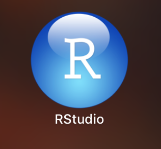
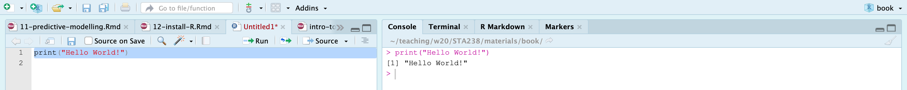
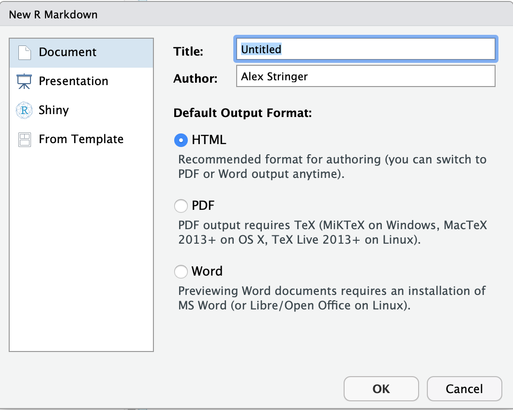
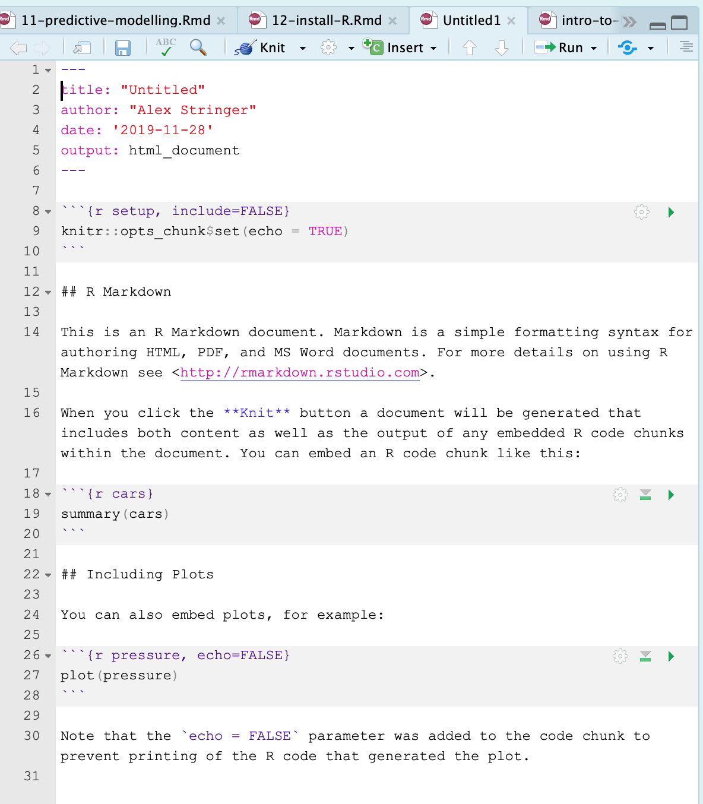

# Installing R and RStudio

This supplementary document contains a guided tutorial on how to install `R`
and `RStudio`, and create a simple document with `RMarkdown`. It is **your responsibility** to have access to a computer on which
you can use these tools. We want to help! However, us providing this help should in
no way be interpreted as us taking on the responsibility of getting these tools
working. In particular, you have an assignment due in the **second week of classes**
that requires these tools, and it is 100% your responsibility to complete it on time.

Most of these screenshots are taken from [https://rstudio.com/products/rstudio/](https://rstudio.com/products/rstudio/).

## Installing R

`R` is the scientific computing language that we will use in this course to perform
statistical compuations-- reading and manipulating data, performing scientific 
computations, and creating automated reports.

Install `R` on your Windows, MacOS or Linux platform by going to [https://cran.rstudio.com/](https://cran.rstudio.com/). Choose the correct
link based on your operating system:

This tutorial proceeds with Windows and Mac; if you're a Linux user (good for you!),
I'm assuming you're familiar with how to install software like this.

**Windows**: click "base":

**Mac**: scroll down and click on the link for the "latest version". At the time of 
this writing, it's 3.6.1, but don't worry if it's increased when you're doing this.

Follow the instructions for your operating system to install the software. There
should be a new icon for `R`, like this on a Mac:

and similar on Windows. Click it to open the software. You should see something
like:

on a Mac, and again similar on Windows. Type `print("Hello world!")` in the console and press `Enter`:

If it runs without errors, good job, you've installed `R`!

## Installing RStudio

`R` is the underlying platform that executes code that you write and returns results. However, you won't usually use `R` directly. You will use `R` through `RStudio`, the most popular Integrated Development Environment (IDE) for `R`.

You can download `RStudio` for your platform [here](https://rstudio.com/products/rstudio/download/#download). Select RStudio Desktop, free version, and make sure to install the correct one for your platform. I think this is displayed automatically; when I go there on my Mac, I see:

Download the installation file and follow the instructions for your system. An icon will appear:

Click this icon to open RStudio. You should see something like this (note: I have set my favourite visual settings, so yours will look slightly different):

The IDE contains four panels. The two important ones for now are:

1. The **console**. You can type `R` code here, and press `Enter` to run it. It is the same as the console from `R` that you saw in the previous step.

1. The **editor**. This is where you will write your programs which involve more than one command-- so, all of your programs. This is where I am currently writing this tutorial! It is just a text editor. You can write code, highlight it, and then press `Cmd+Enter` or `Shift+Enter` to run it. Give it a try: click the `+` icon in the top right corner of `RStudio`, and click "R script":

A blank script will open. Type `print("Hello World!")`, highlight the code, and press `Cmd+Enter` (mac) or `Ctrl+Enter` (windows):

If this works, you are successfully using `RStudio`!

## Using RMarkdown

One of the real powers of using `R` and `RStudio` is the ability to automatically create typeset documents containing the results of running your code combined with text. 

First, make sure the `rmarkdown` package is installed. Open `RStudio` and in the Console, type `install.packages("rmarkdown")`. The `rmarkdown` package will be installed.

Now, click the `+` icon in the top-right corner, and select "R Markdown":

Leave all the default settings as they are. You should see a new script open up, prepopulated with some text and code:

Click anywhere in this document (so the cursor is in the editor) and press `Cmd+Shift+K` or `Ctrl+Shift+K`. You'll be prompted to save the script; do this, and wait a moment, and then a document will magically be created and appear in the `Viewer` pane:

This document is itself a tutorial for using `RMarkdown`. Read this; it explains how to add text, and code, right in the editor, and then magically create a report. When you change the code or the text, you create the report again, and everything is typeset properly. Not only does this save you time, but it ensures that all your output matches the code that was used to create it, reducing human error. This notion is part of the broader concept of **reproducibility**, which is very important in modern scientific practice.

As a test of your use of `RMarkdown`, try to add the following three items to this report:

1. The title "My First RMarkdown Report". Look up at the top where it says "title".

1. The first few rows of the `cars` dataset. You can get this with the `head(cars)` command. My output looks like:

1. A pairs plot of the `iris` dataset. You can add this with `pairs(iris)`. My output looks like:

